# 🌾 AgriTech Platform - Architecture Diagrams

## 1. 🚀 API Endpoints Structure

```mermaid
graph TD
    A[AgriTech Platform API] --> B[Authentication Routes]
    A --> C[Listings Management]
    A --> D[General Features]
    A --> E[Seller Features]
    A --> F[Bidding System]
    A --> G[Real-time Features]
    A --> H[Price Tracking]
    A --> I[Mobile Features]

    %% Authentication Routes
    B --> B1[POST /auth/register]
    B --> B2[POST /auth/verify-email]
    B --> B3[POST /auth/resend-verification-email]
    B --> B4[POST /auth/login]
    B --> B5[POST /auth/refresh]
    B --> B6[POST /auth/send-password-reset-otp]
    B --> B7[POST /auth/set-new-password]
    B --> B8[POST /auth/logout]

    %% Listings Management
    C --> C1[GET /listings]
    C --> C2[GET /listings/{slug}]
    C --> C3[GET /categories]
    C --> C4[GET /categories/{slug}]
    C --> C5[GET /commodity-listings]
    C --> C6[POST /commodity-listings]
    C --> C7[GET /commodity-listings/{slug}]

    %% General Features
    D --> D1[GET /general/site-detail]
    D --> D2[POST /general/subscribe]
    D --> D3[GET /general/reviews]

    %% Seller Features
    E --> E1[GET /seller/profile]
    E --> E2[POST /seller/listings]
    E --> E3[PUT /seller/listings/{id}]
    E --> E4[DELETE /seller/listings/{id}]
    E --> E5[GET /seller/analytics]

    %% Bidding System
    F --> F1[POST /bids]
    F --> F2[GET /bids/my-bids]
    F --> F3[GET /bids/listing/{listing_id}]
    F --> F4[PUT /bids/{bid_id}]
    F --> F5[DELETE /bids/{bid_id}]

    %% Real-time Features
    G --> G1[WebSocket /ws/auction/{room_id}]
    G --> G2[WebSocket /ws/bids/{listing_id}]
    G --> G3[GET /auction-rooms]
    G --> G4[POST /auction-rooms]

    %% Price Tracking
    H --> H1[GET /price-history/{commodity_slug}]
    H --> H2[POST /alert-subs]
    H --> H3[DELETE /alert-subs/{sub_id}]
    H --> H4[GET /price-alerts/my-alerts]

    %% Mobile Features
    I --> I1[POST /mobile/register-device]
    I --> I2[PUT /mobile/notification-preferences]
    I --> I3[GET /mobile/notifications]
    I --> I4[POST /mobile/location]

    %% Parameter Details
    B1 -.-> B1P[Parameters: first_name, last_name, email, password, terms_agreement, role]
    B4 -.-> B4P[Parameters: email, password]
    C6 -.-> C6P[Parameters: commodity_name, description, quantity_kg, min_price, category_id, harvest_date]
    F1 -.-> F1P[Parameters: listing_id/commodity_listing_id, amount, message]
    H2 -.-> H2P[Parameters: commodity_slug, direction, threshold_price, notification_type]

    %% Authentication Requirements
    B1 --> AUTH1[Public]
    B4 --> AUTH1
    C1 --> AUTH1
    C3 --> AUTH1
    
    E1 --> AUTH2[Authenticated Users]
    F1 --> AUTH2
    G1 --> AUTH2
    H2 --> AUTH2

    %% Response Formats
    B1 --> RESP1[Success: 201, Error: 422]
    C1 --> RESP2[Success: 200 + Pagination]
    F1 --> RESP3[Success: 201, Error: 400/401]
    H1 --> RESP4[Success: 200 + Time Series Data]

    style A fill:#e1f5fe
    style B fill:#f3e5f5
    style C fill:#e8f5e8
    style D fill:#fff3e0
    style E fill:#fce4ec
    style F fill:#e0f2f1
    style G fill:#f1f8e9
    style H fill:#e3f2fd
    style I fill:#fef7e0
```

## 2. 🗄️ Database Structure & Relationships

```mermaid
erDiagram
    %% Core User Management
    USERS {
        uuid id PK
        string first_name
        string last_name
        string email UK
        string password
        boolean is_email_verified
        boolean is_superuser
        boolean is_staff
        boolean terms_agreement
        enum role "FARMER, TRADER, ADMIN"
        string upi_id
        string bank_account
        string ifsc_code
        boolean is_verified
        uuid avatar_id FK
        datetime created_at
        datetime updated_at
    }

    %% Authentication & Security
    JWTS {
        uuid id PK
        uuid user_id FK
        string access
        string refresh
        datetime created_at
        datetime updated_at
    }

    OTPS {
        uuid id PK
        uuid user_id FK
        integer code
        datetime created_at
        datetime updated_at
    }

    %% File Management
    FILES {
        uuid id PK
        string resource_type
        datetime created_at
        datetime updated_at
    }

    %% Categories & Products
    CATEGORIES {
        uuid id PK
        string name UK
        string slug UK
        datetime created_at
        datetime updated_at
    }

    %% Agricultural Listings
    COMMODITY_LISTINGS {
        uuid id PK
        uuid farmer_id FK
        string commodity_name
        string slug UK
        text description
        float quantity_kg
        date harvest_date
        decimal min_price
        decimal highest_bid
        integer bids_count
        boolean is_approved
        boolean is_active
        datetime closing_date
        uuid category_id FK
        uuid image_id FK
        datetime created_at
        datetime updated_at
    }

    %% Traditional Listings
    LISTINGS {
        uuid id PK
        uuid auctioneer_id FK
        string name
        string slug UK
        text desc
        uuid category_id FK
        decimal price
        decimal highest_bid
        integer bids_count
        datetime closing_date
        boolean active
        uuid image_id FK
        datetime created_at
        datetime updated_at
    }

    %% Bidding System
    BIDS {
        uuid id PK
        uuid user_id FK
        uuid listing_id FK "nullable"
        uuid commodity_listing_id FK "nullable"
        decimal amount
        text message
        enum status "ACTIVE, ACCEPTED, REJECTED, WITHDRAWN, EXPIRED"
        datetime bid_time
        datetime expires_at
        datetime created_at
        datetime updated_at
    }

    %% Real-time Auction Rooms
    AUCTION_ROOMS {
        uuid id PK
        string name
        string slug UK
        text description
        uuid commodity_listing_id FK
        boolean is_active
        datetime start_time
        datetime end_time
        integer participants_count
        decimal current_price
        datetime created_at
        datetime updated_at
    }

    %% Price Tracking & Analytics
    PRICE_HISTORY {
        uuid id PK
        string commodity_name
        string market_location
        decimal price_per_kg
        date price_date
        string source "AGMARKNET, E_NAM, MANUAL"
        json metadata
        datetime created_at
        datetime updated_at
    }

    ALERT_SUBSCRIPTIONS {
        uuid id PK
        uuid user_id FK
        string commodity_slug
        enum direction "ABOVE, BELOW"
        decimal threshold_price
        enum notification_type "EMAIL, SMS, PUSH"
        boolean is_active
        datetime last_triggered
        datetime created_at
        datetime updated_at
    }

    %% Mobile & Notifications
    DEVICE_REGISTRATIONS {
        uuid id PK
        uuid user_id FK
        string device_token
        enum device_type "IOS, ANDROID, WEB"
        string app_version
        boolean is_active
        datetime last_active
        datetime created_at
        datetime updated_at
    }

    NOTIFICATION_PREFERENCES {
        uuid id PK
        uuid user_id FK
        boolean email_notifications
        boolean sms_notifications
        boolean push_notifications
        boolean price_alerts
        boolean bid_updates
        boolean auction_reminders
        datetime created_at
        datetime updated_at
    }

    NOTIFICATION_LOGS {
        uuid id PK
        uuid user_id FK
        enum channel "EMAIL, SMS, PUSH"
        string title
        text message
        enum status "SENT, FAILED, PENDING"
        json metadata
        datetime sent_at
        datetime created_at
        datetime updated_at
    }

    %% User Activity & Location
    USER_ACTIVITIES {
        uuid id PK
        uuid user_id FK
        string activity_type
        string description
        string ip_address
        string user_agent
        json metadata
        datetime created_at
    }

    USER_LOCATIONS {
        uuid id PK
        uuid user_id FK
        decimal latitude
        decimal longitude
        string address
        string city
        string state
        string country
        boolean is_primary
        datetime created_at
        datetime updated_at
    }

    %% General Content
    SITEDETAILS {
        uuid id PK
        string name
        string email
        string phone
        string address
        string fb
        string tw
        string wh
        string ig
        datetime created_at
        datetime updated_at
    }

    REVIEWS {
        uuid id PK
        uuid reviewer_id FK
        boolean show
        string text
        datetime created_at
        datetime updated_at
    }

    SUBSCRIBERS {
        uuid id PK
        string email UK
        boolean exported
        datetime created_at
        datetime updated_at
    }

    GUESTUSERS {
        uuid id PK
        datetime created_at
        datetime updated_at
    }

    %% Relationships
    USERS ||--o{ JWTS : "has"
    USERS ||--o{ OTPS : "has"
    USERS ||--o| FILES : "avatar"
    USERS ||--o{ COMMODITY_LISTINGS : "creates"
    USERS ||--o{ LISTINGS : "creates"
    USERS ||--o{ BIDS : "places"
    USERS ||--o{ ALERT_SUBSCRIPTIONS : "subscribes"
    USERS ||--o{ DEVICE_REGISTRATIONS : "registers"
    USERS ||--|| NOTIFICATION_PREFERENCES : "has"
    USERS ||--o{ NOTIFICATION_LOGS : "receives"
    USERS ||--o{ USER_ACTIVITIES : "performs"
    USERS ||--o{ USER_LOCATIONS : "has"
    USERS ||--o{ REVIEWS : "writes"

    CATEGORIES ||--o{ COMMODITY_LISTINGS : "categorizes"
    CATEGORIES ||--o{ LISTINGS : "categorizes"

    COMMODITY_LISTINGS ||--o{ BIDS : "receives"
    COMMODITY_LISTINGS ||--o| AUCTION_ROOMS : "has"
    COMMODITY_LISTINGS ||--o| FILES : "image"

    LISTINGS ||--o{ BIDS : "receives"
    LISTINGS ||--o| FILES : "image"

    PRICE_HISTORY ||--o{ ALERT_SUBSCRIPTIONS : "triggers"
```



## 3. 🔄 API-Database Integration & Feature Flow

```mermaid
graph TB
    %% External Systems
    EXT1[AgMarknet API]
    EXT2[e-NAM API]
    EXT3[FCM Push Service]
    EXT4[Email Service SMTP]
    EXT5[SMS Gateway]

    %% API Layer
    subgraph "API Layer"
        AUTH[Authentication APIs]
        LISTING[Listing APIs]
        BID[Bidding APIs]
        PRICE[Price APIs]
        MOBILE[Mobile APIs]
        WS[WebSocket APIs]
    end

    %% Business Logic
    subgraph "Business Logic Layer"
        AUTH_MGR[User Management]
        LIST_MGR[Listing Management]
        BID_MGR[Bid Management]
        PRICE_MGR[Price Management]
        NOTIF_MGR[Notification Management]
        CACHE_MGR[Cache Management]
    end

    %% Database Layer
    subgraph "Database Layer"
        DB_USER[(Users Tables)]
        DB_LISTING[(Listing Tables)]
        DB_BID[(Bidding Tables)]
        DB_PRICE[(Price Tables)]
        DB_MOBILE[(Mobile Tables)]
        DB_GENERAL[(General Tables)]
    end

    %% Background Services
    subgraph "Background Services"
        CELERY[Celery Workers]
        REDIS[Redis Cache/PubSub]
        SCHEDULER[Price Data Scheduler]
        ALERT_WORKER[Alert Worker]
    end

    %% User Flows
    subgraph "User Authentication Flow"
        U1[User Registration] --> AUTH
        AUTH --> AUTH_MGR
        AUTH_MGR --> DB_USER
        AUTH_MGR --> NOTIF_MGR
        NOTIF_MGR --> EXT4
    end

    subgraph "Commodity Listing Flow"
        U2[Farmer Creates Listing] --> LISTING
        LISTING --> LIST_MGR
        LIST_MGR --> DB_LISTING
        LIST_MGR --> CACHE_MGR
        CACHE_MGR --> REDIS
    end

    subgraph "Real-time Bidding Flow"
        U3[Trader Places Bid] --> BID
        BID --> BID_MGR
        BID_MGR --> DB_BID
        BID_MGR --> WS
        WS --> REDIS
        REDIS --> WS
        WS --> U4[Live Bid Updates]
    end

    subgraph "Price Tracking Flow"
        SCHEDULER --> EXT1
        SCHEDULER --> EXT2
        EXT1 --> PRICE_MGR
        EXT2 --> PRICE_MGR
        PRICE_MGR --> DB_PRICE
        PRICE_MGR --> ALERT_WORKER
        ALERT_WORKER --> DB_MOBILE
        ALERT_WORKER --> EXT3
        ALERT_WORKER --> EXT4
        ALERT_WORKER --> EXT5
    end

    subgraph "Mobile Integration Flow"
        U5[Mobile App] --> MOBILE
        MOBILE --> NOTIF_MGR
        NOTIF_MGR --> DB_MOBILE
        NOTIF_MGR --> EXT3
    end

    %% Feature Highlights
    subgraph "Key Features Implemented"
        F1[✅ User Authentication & KYC]
        F2[✅ Agricultural Categories]
        F3[✅ Commodity Listings]
        F4[✅ Real-time Bidding]
        F5[✅ WebSocket Integration]
        F6[✅ Price History Tracking]
        F7[✅ Alert Subscriptions]
        F8[✅ Mobile Device Management]
        F9[✅ Push Notifications]
        F10[✅ User Activity Logging]
        F11[✅ Auction Rooms]
        F12[✅ Multi-role System]
    end

    %% Pending Features
    subgraph "Phase 5-8 Roadmap"
        P1[🔄 Celery Price Data Tasks]
        P2[🔄 ML Price Predictions]
        P3[🔄 Advanced Security & RBAC]
        P4[🔄 React Frontend]
        P5[🔄 Multilingual Support]
        P6[🔄 Performance Optimization]
    end

    %% Database Connections
    DB_USER -.-> USERS
    DB_USER -.-> JWTS
    DB_USER -.-> OTPS

    DB_LISTING -.-> CATEGORIES
    DB_LISTING -.-> COMMODITY_LISTINGS
    DB_LISTING -.-> LISTINGS

    DB_BID -.-> BIDS
    DB_BID -.-> AUCTION_ROOMS

    DB_PRICE -.-> PRICE_HISTORY
    DB_PRICE -.-> ALERT_SUBSCRIPTIONS

    DB_MOBILE -.-> DEVICE_REGISTRATIONS
    DB_MOBILE -.-> NOTIFICATION_PREFERENCES
    DB_MOBILE -.-> NOTIFICATION_LOGS

    %% Styling
    style AUTH fill:#e1f5fe
    style LISTING fill:#e8f5e8
    style BID fill:#fff3e0
    style PRICE fill:#f3e5f5
    style MOBILE fill:#e0f2f1
    style WS fill:#fef7e0

    style DB_USER fill:#ffebee
    style DB_LISTING fill:#f1f8e9
    style DB_BID fill:#e8eaf6
    style DB_PRICE fill:#fce4ec
    style DB_MOBILE fill:#e0f7fa

    style CELERY fill:#fff8e1
    style REDIS fill:#ffebee
    style SCHEDULER fill:#f3e5f5
```



## 🎯 Current Implementation Status

### ✅ **Completed Features**

1. **Authentication System**
   - User registration with email verification
   - JWT-based authentication
   - Password reset functionality
   - Multi-role support (FARMER, TRADER, ADMIN)

2. **Agricultural Listings**
   - Category management (8 agricultural categories)
   - Commodity listings with harvest dates
   - Image upload support
   - Slug-based URLs

3. **Real-time Bidding**
   - WebSocket integration
   - Live bid updates
   - Auction rooms
   - Bid status tracking

4. **Price Tracking Foundation**
   - Price history model
   - Alert subscription system
   - Multi-channel notifications (EMAIL, SMS, PUSH)

5. **Mobile Integration**
   - Device registration
   - Push notification support
   - User preferences
   - Activity logging

### 🔄 **Next Phase Priorities**

1. **Phase 5: Price History & Alerts**
   - Celery task for daily price data fetching
   - AgMarknet/e-NAM API integration
   - Automated alert processing

2. **Phase 6: ML Recommendations**
   - Price prediction models
   - Buy/Sell suggestions
   - Confidence scoring

3. **Phase 7: Security & Testing**
   - RBAC implementation
   - Rate limiting
   - Comprehensive testing

4. **Phase 8: Frontend & Deployment**
   - React frontend
   - Multilingual support
   - Production deployment

### 🏗️ **Architecture Strengths**

- **Scalable Design**: Async FastAPI with PostgreSQL
- **Real-time Capabilities**: WebSocket + Redis pub/sub
- **Mobile-Ready**: FCM integration and device management
- **Extensible**: Clean separation of concerns
- **Agricultural Focus**: Domain-specific models and features

### 📊 **Database Statistics**

- **Tables**: 15 core tables
- **Relationships**: 25+ foreign key relationships
- **Indexes**: Optimized for query performance
- **Constraints**: Data integrity enforcement
- **Scalability**: UUID primary keys for distributed systems

This architecture provides a solid foundation for building a production-ready Smart Agri-Bidding Platform with all the features outlined in your roadmap.
