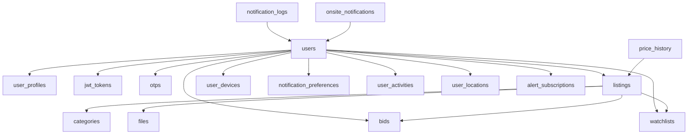

# 🗄️ Database Schema Documentation

## 📊 **AgriTech Platform Database Structure**

This document provides a comprehensive overview of the database schema for the AgriTech Smart Bidding Platform. The database is designed to support agricultural commodity trading, real-time bidding, user management, and ML-powered recommendations.

---

## 🏗️ **Database Architecture Overview**

### **Database Technology**

- **Primary Database**: PostgreSQL 15+ (Production)
- **Cache Layer**: Redis 7+ (Session, Real-time data)
- **Search Engine**: PostgreSQL Full-text Search
- **Migrations**: Alembic (SQLAlchemy)

### **Design Principles**

- ✅ **Normalization**: Minimized data redundancy
- ✅ **Indexing**: Optimized for query performance
- ✅ **Constraints**: Data integrity enforcement
- ✅ **Scalability**: Designed for horizontal scaling
- ✅ **Security**: Encrypted sensitive data

---

## 📋 **Table Structure Overview**

### **Core Tables (11 tables)**

1. **users** - User accounts and authentication
2. **user_profiles** - Extended user information
3. **jwt_tokens** - Authentication tokens
4. **otps** - One-time passwords
5. **categories** - Commodity categories
6. **listings** - Commodity listings/auctions
7. **bids** - Auction bids
8. **watchlists** - User watchlists
9. **files** - File/image uploads
10. **site_details** - Application settings
11. **reviews** - Platform reviews

### **Advanced Features (8 tables)**

12. **price_history** - Historical price data
13. **alert_subscriptions** - Price alerts
14. **user_devices** - Mobile device registration
15. **notification_preferences** - User notification settings
16. **notification_logs** - Notification history
17. **user_activities** - Activity tracking
18. **user_locations** - Geographic data
19. **onsite_notifications** - In-app notifications

---

## 👥 **User Management Tables**

### **1. users**

**Purpose**: Core user authentication and basic information

| Column              | Type         | Constraints      | Description                       |
| ------------------- | ------------ | ---------------- | --------------------------------- |
| `id`                | UUID         | PRIMARY KEY      | Unique user identifier            |
| `first_name`        | VARCHAR(50)  | NOT NULL         | User's first name                 |
| `last_name`         | VARCHAR(50)  | NOT NULL         | User's last name                  |
| `email`             | VARCHAR(255) | UNIQUE, NOT NULL | Email address (login)             |
| `password`          | VARCHAR(255) | NOT NULL         | Hashed password                   |
| `is_email_verified` | BOOLEAN      | DEFAULT FALSE    | Email verification status         |
| `is_verified`       | BOOLEAN      | DEFAULT FALSE    | KYC verification status           |
| `is_active`         | BOOLEAN      | DEFAULT TRUE     | Account active status             |
| `is_superuser`      | BOOLEAN      | DEFAULT FALSE    | Admin privileges                  |
| `is_staff`          | BOOLEAN      | DEFAULT FALSE    | Staff privileges                  |
| `avatar`            | UUID         | FK(files.id)     | Profile picture                   |
| `role`              | ENUM         | NOT NULL         | User role (FARMER, TRADER, ADMIN) |
| `terms_agreement`   | BOOLEAN      | DEFAULT FALSE    | Terms acceptance                  |
| `created_at`        | TIMESTAMP    | DEFAULT NOW()    | Account creation time             |
| `updated_at`        | TIMESTAMP    | DEFAULT NOW()    | Last update time                  |

**Indexes**:

- `idx_users_email` (email)
- `idx_users_role` (role)
- `idx_users_is_verified` (is_verified)

**Business Rules**:

- Only verified users can place bids
- Farmers can create listings
- Farmers can manage their own auctions and list products
- Email must be unique across the platform

---

### **2. user_profiles**

**Purpose**: Extended user profile information

| Column               | Type         | Constraints          | Description                  |
| -------------------- | ------------ | -------------------- | ---------------------------- |
| `id`                 | UUID         | PRIMARY KEY          | Profile identifier           |
| `user_id`            | UUID         | FK(users.id), UNIQUE | Reference to user            |
| `phone_number`       | VARCHAR(20)  | UNIQUE               | Contact number               |
| `address`            | TEXT         |                      | Physical address             |
| `city`               | VARCHAR(100) |                      | City                         |
| `state`              | VARCHAR(100) |                      | State/Province               |
| `country`            | VARCHAR(100) |                      | Country                      |
| `postal_code`        | VARCHAR(20)  |                      | ZIP/Postal code              |
| `date_of_birth`      | DATE         |                      | Birth date                   |
| `gender`             | ENUM         |                      | Gender (MALE, FEMALE, OTHER) |
| `bio`                | TEXT         |                      | User biography               |
| `company_name`       | VARCHAR(200) |                      | Business name                |
| `tax_id`             | VARCHAR(50)  |                      | Tax identification           |
| `bank_account`       | VARCHAR(100) |                      | Banking details              |
| `kyc_documents`      | JSONB        |                      | KYC document references      |
| `verification_notes` | TEXT         |                      | Admin verification notes     |
| `created_at`         | TIMESTAMP    | DEFAULT NOW()        | Profile creation             |
| `updated_at`         | TIMESTAMP    | DEFAULT NOW()        | Last profile update          |

**Indexes**:

- `idx_user_profiles_user_id` (user_id)
- `idx_user_profiles_phone` (phone_number)

---

### **3. jwt_tokens**

**Purpose**: JWT token management for authentication

| Column          | Type      | Constraints   | Description        |
| --------------- | --------- | ------------- | ------------------ |
| `id`            | UUID      | PRIMARY KEY   | Token identifier   |
| `user_id`       | UUID      | FK(users.id)  | Token owner        |
| `access_token`  | TEXT      | NOT NULL      | JWT access token   |
| `refresh_token` | TEXT      | NOT NULL      | JWT refresh token  |
| `expires_at`    | TIMESTAMP | NOT NULL      | Token expiration   |
| `is_active`     | BOOLEAN   | DEFAULT TRUE  | Token validity     |
| `device_info`   | JSONB     |               | Device information |
| `ip_address`    | INET      |               | Login IP address   |
| `created_at`    | TIMESTAMP | DEFAULT NOW() | Token creation     |

**Indexes**:

- `idx_jwt_tokens_user_id` (user_id)
- `idx_jwt_tokens_refresh` (refresh_token)

---

### **4. otps**

**Purpose**: One-time password verification

| Column       | Type      | Constraints   | Description                                |
| ------------ | --------- | ------------- | ------------------------------------------ |
| `id`         | UUID      | PRIMARY KEY   | OTP identifier                             |
| `user_id`    | UUID      | FK(users.id)  | User reference                             |
| `code`       | INTEGER   | NOT NULL      | 6-digit OTP code                           |
| `purpose`    | ENUM      | NOT NULL      | OTP purpose (EMAIL_VERIFY, PASSWORD_RESET) |
| `expires_at` | TIMESTAMP | NOT NULL      | OTP expiration                             |
| `is_used`    | BOOLEAN   | DEFAULT FALSE | Usage status                               |
| `created_at` | TIMESTAMP | DEFAULT NOW() | OTP generation time                        |

**Indexes**:

- `idx_otps_user_id` (user_id)
- `idx_otps_code` (code)

---

## 🏪 **Marketplace Tables**

### **5. categories**

**Purpose**: Commodity categories and subcategories

| Column        | Type         | Constraints       | Description                         |
| ------------- | ------------ | ----------------- | ----------------------------------- |
| `id`          | UUID         | PRIMARY KEY       | Category identifier                 |
| `name`        | VARCHAR(100) | NOT NULL          | Category name                       |
| `slug`        | VARCHAR(100) | UNIQUE, NOT NULL  | URL-friendly name                   |
| `description` | TEXT         |                   | Category description                |
| `image`       | UUID         | FK(files.id)      | Category image                      |
| `parent_id`   | UUID         | FK(categories.id) | Parent category (for subcategories) |
| `is_active`   | BOOLEAN      | DEFAULT TRUE      | Category status                     |
| `sort_order`  | INTEGER      | DEFAULT 0         | Display order                       |
| `metadata`    | JSONB        |                   | Additional category data            |
| `created_at`  | TIMESTAMP    | DEFAULT NOW()     | Creation time                       |
| `updated_at`  | TIMESTAMP    | DEFAULT NOW()     | Last update                         |

**Indexes**:

- `idx_categories_slug` (slug)
- `idx_categories_parent_id` (parent_id)
- `idx_categories_is_active` (is_active)

**Sample Categories**:

```
- Grains
  ├── Wheat
  ├── Rice
  ├── Corn
- Vegetables
  ├── Tomatoes
  ├── Onions
- Fruits
  ├── Apples
  ├── Mangoes
```

---

### **6. listings**

**Purpose**: Commodity listings and auction details

| Column              | Type          | Constraints                 | Description                                |
| ------------------- | ------------- | --------------------------- | ------------------------------------------ |
| `id`                | UUID          | PRIMARY KEY                 | Listing identifier                         |
| `auctioneer_id`     | UUID          | FK(users.id), NOT NULL      | Farmer/seller who created the listing      |
| `category_id`       | UUID          | FK(categories.id), NOT NULL | Commodity category                         |
| `name`              | VARCHAR(200)  | NOT NULL                    | Commodity name                             |
| `slug`              | VARCHAR(200)  | UNIQUE, NOT NULL            | URL-friendly identifier                    |
| `desc`              | TEXT          | NOT NULL                    | Detailed description                       |
| `image`             | UUID          | FK(files.id)                | Primary image                              |
| `price`             | DECIMAL(12,2) | NOT NULL                    | Starting/reserve price                     |
| `closing_date`      | TIMESTAMP     | NOT NULL                    | Auction end time                           |
| `highest_bid`       | DECIMAL(12,2) | DEFAULT 0                   | Current highest bid                        |
| `bids_count`        | INTEGER       | DEFAULT 0                   | Number of bids                             |
| `active`            | BOOLEAN       | DEFAULT TRUE                | Listing status                             |
| `approved`          | BOOLEAN       | DEFAULT FALSE               | Admin approval                             |
| `quantity`          | DECIMAL(10,2) | NOT NULL                    | Quantity available                         |
| `unit`              | ENUM          | NOT NULL                    | Unit of measure (KG, TONNES, BAGS, PIECES) |
| `quality_grade`     | ENUM          |                             | Quality grade (A, B, C, PREMIUM)           |
| `harvest_date`      | DATE          |                             | Harvest date                               |
| `storage_location`  | VARCHAR(200)  |                             | Storage facility                           |
| `delivery_terms`    | TEXT          |                             | Delivery conditions                        |
| `payment_terms`     | TEXT          |                             | Payment conditions                         |
| `min_bid_increment` | DECIMAL(8,2)  | DEFAULT 1.00                | Minimum bid step                           |
| `auto_extend`       | BOOLEAN       | DEFAULT TRUE                | Auto-extend auction                        |
| `reserve_met`       | BOOLEAN       | DEFAULT FALSE               | Reserve price met                          |
| `featured`          | BOOLEAN       | DEFAULT FALSE               | Featured listing                           |
| `metadata`          | JSONB         |                             | Additional listing data                    |
| `created_at`        | TIMESTAMP     | DEFAULT NOW()               | Listing creation                           |
| `updated_at`        | TIMESTAMP     | DEFAULT NOW()               | Last update                                |

**Indexes**:

- `idx_listings_auctioneer_id` (auctioneer_id)
- `idx_listings_category_id` (category_id)
- `idx_listings_slug` (slug)
- `idx_listings_active` (active)
- `idx_listings_closing_date` (closing_date)
- `idx_listings_featured` (featured)

**Listing Statuses**:

- `DRAFT` - Being created
- `PENDING` - Awaiting approval
- `ACTIVE` - Live auction
- `CLOSED` - Auction ended
- `SOLD` - Successfully sold
- `CANCELLED` - Cancelled by owner

---

### **7. bids**

**Purpose**: Auction bids and bidding history

| Column              | Type          | Constraints               | Description             |
| ------------------- | ------------- | ------------------------- | ----------------------- |
| `id`                | UUID          | PRIMARY KEY               | Bid identifier          |
| `user_id`           | UUID          | FK(users.id), NOT NULL    | Bidder                  |
| `listing_id`        | UUID          | FK(listings.id), NOT NULL | Auction listing         |
| `amount`            | DECIMAL(12,2) | NOT NULL                  | Bid amount              |
| `auto_bid`          | BOOLEAN       | DEFAULT FALSE             | Automatic bid           |
| `max_auto_bid`      | DECIMAL(12,2) |                           | Maximum auto-bid amount |
| `is_winning`        | BOOLEAN       | DEFAULT FALSE             | Current winning bid     |
| `bid_time`          | TIMESTAMP     | DEFAULT NOW()             | Bid placement time      |
| `ip_address`        | INET          |                           | Bidder IP address       |
| `user_agent`        | TEXT          |                           | Browser information     |
| `proxy_bid`         | BOOLEAN       | DEFAULT FALSE             | Proxy/auto bid          |
| `retracted`         | BOOLEAN       | DEFAULT FALSE             | Bid retraction          |
| `retraction_reason` | TEXT          |                           | Retraction explanation  |
| `created_at`        | TIMESTAMP     | DEFAULT NOW()             | Bid creation            |

**Indexes**:

- `idx_bids_user_id` (user_id)
- `idx_bids_listing_id` (listing_id)
- `idx_bids_amount` (amount)
- `idx_bids_bid_time` (bid_time)
- `idx_bids_is_winning` (is_winning)

**Business Rules**:

- Each bid must be higher than the previous highest bid
- Bidders cannot bid on their own listings
- Auto-bids execute up to the maximum amount
- Winning bid is automatically calculated

---

### **8. watchlists**

**Purpose**: User's saved/favorite listings

| Column       | Type      | Constraints               | Description           |
| ------------ | --------- | ------------------------- | --------------------- |
| `id`         | UUID      | PRIMARY KEY               | Watchlist identifier  |
| `user_id`    | UUID      | FK(users.id)              | Watchlist owner       |
| `guest_id`   | UUID      |                           | Guest user identifier |
| `listing_id` | UUID      | FK(listings.id), NOT NULL | Watched listing       |
| `created_at` | TIMESTAMP | DEFAULT NOW()             | Added to watchlist    |

**Indexes**:

- `idx_watchlists_user_id` (user_id)
- `idx_watchlists_listing_id` (listing_id)
- `idx_watchlists_guest_id` (guest_id)

**Unique Constraints**:

- `uq_watchlist_user_listing` (user_id, listing_id)
- `uq_watchlist_guest_listing` (guest_id, listing_id)

---

### **9. files**

**Purpose**: File and image upload management

| Column           | Type         | Constraints   | Description           |
| ---------------- | ------------ | ------------- | --------------------- |
| `id`             | UUID         | PRIMARY KEY   | File identifier       |
| `resource_type`  | VARCHAR(100) | NOT NULL      | MIME type             |
| `name`           | VARCHAR(255) |               | Original filename     |
| `size`           | INTEGER      |               | File size in bytes    |
| `url`            | TEXT         |               | File URL (Cloudinary) |
| `public_id`      | VARCHAR(255) |               | Cloud storage ID      |
| `width`          | INTEGER      |               | Image width           |
| `height`         | INTEGER      |               | Image height          |
| `format`         | VARCHAR(10)  |               | File format           |
| `uploaded_by`    | UUID         | FK(users.id)  | Uploader              |
| `upload_session` | UUID         |               | Upload session ID     |
| `is_active`      | BOOLEAN      | DEFAULT TRUE  | File status           |
| `created_at`     | TIMESTAMP    | DEFAULT NOW() | Upload time           |

**Indexes**:

- `idx_files_resource_type` (resource_type)
- `idx_files_uploaded_by` (uploaded_by)
- `idx_files_public_id` (public_id)

---

## 📊 **Price Tracking & Analytics**

### **10. price_history**

**Purpose**: Historical price data for commodities

| Column           | Type          | Constraints   | Description                         |
| ---------------- | ------------- | ------------- | ----------------------------------- |
| `id`             | UUID          | PRIMARY KEY   | Price record identifier             |
| `commodity_slug` | VARCHAR(200)  | NOT NULL      | Commodity identifier                |
| `commodity_name` | VARCHAR(200)  | NOT NULL      | Display name                        |
| `price`          | DECIMAL(12,2) | NOT NULL      | Price value                         |
| `unit`           | VARCHAR(20)   | NOT NULL      | Price unit                          |
| `market_name`    | VARCHAR(100)  |               | Market/source name                  |
| `location`       | VARCHAR(100)  |               | Geographic location                 |
| `quality_grade`  | VARCHAR(20)   |               | Quality specification               |
| `volume_traded`  | DECIMAL(12,2) |               | Trading volume                      |
| `price_change`   | DECIMAL(8,4)  |               | Price change percentage             |
| `data_source`    | VARCHAR(50)   | NOT NULL      | Data source (API, MANUAL, SCRAPING) |
| `recorded_at`    | TIMESTAMP     | NOT NULL      | Price recording time                |
| `created_at`     | TIMESTAMP     | DEFAULT NOW() | Record creation                     |

**Indexes**:

- `idx_price_history_commodity` (commodity_slug)
- `idx_price_history_recorded_at` (recorded_at)
- `idx_price_history_location` (location)

**Sample Data**:

```json
{
  "commodity_slug": "wheat-premium",
  "commodity_name": "Premium Wheat",
  "price": 125.5,
  "unit": "per quintal",
  "market_name": "APMC Pune",
  "location": "Maharashtra, India",
  "quality_grade": "A",
  "volume_traded": 1500.0,
  "data_source": "API"
}
```

---

### **11. alert_subscriptions**

**Purpose**: Price alert subscriptions

| Column                 | Type          | Constraints            | Description                                         |
| ---------------------- | ------------- | ---------------------- | --------------------------------------------------- |
| `id`                   | UUID          | PRIMARY KEY            | Alert identifier                                    |
| `user_id`              | UUID          | FK(users.id), NOT NULL | Subscriber                                          |
| `commodity_slug`       | VARCHAR(200)  | NOT NULL               | Monitored commodity                                 |
| `commodity_name`       | VARCHAR(200)  | NOT NULL               | Display name                                        |
| `alert_type`           | ENUM          | NOT NULL               | Alert type (PRICE_ABOVE, PRICE_BELOW, PRICE_CHANGE) |
| `threshold_value`      | DECIMAL(12,2) | NOT NULL               | Trigger value                                       |
| `percentage_change`    | DECIMAL(5,2)  |                        | Percentage threshold                                |
| `is_active`            | BOOLEAN       | DEFAULT TRUE           | Alert status                                        |
| `notification_methods` | JSONB         | NOT NULL               | Delivery methods                                    |
| `last_triggered`       | TIMESTAMP     |                        | Last alert time                                     |
| `trigger_count`        | INTEGER       | DEFAULT 0              | Number of triggers                                  |
| `created_at`           | TIMESTAMP     | DEFAULT NOW()          | Subscription creation                               |
| `updated_at`           | TIMESTAMP     | DEFAULT NOW()          | Last update                                         |

**Indexes**:

- `idx_alert_subscriptions_user_id` (user_id)
- `idx_alert_subscriptions_commodity` (commodity_slug)
- `idx_alert_subscriptions_active` (is_active)

**Notification Methods**:

```json
{
  "email": true,
  "sms": false,
  "push": true,
  "in_app": true
}
```

---

## 📱 **Mobile & Notifications**

### **12. user_devices**

**Purpose**: Mobile device registration for push notifications

| Column         | Type         | Constraints            | Description                     |
| -------------- | ------------ | ---------------------- | ------------------------------- |
| `id`           | UUID         | PRIMARY KEY            | Device identifier               |
| `user_id`      | UUID         | FK(users.id), NOT NULL | Device owner                    |
| `device_id`    | VARCHAR(255) | UNIQUE, NOT NULL       | Unique device identifier        |
| `fcm_token`    | TEXT         |                        | Firebase Cloud Messaging token  |
| `apns_token`   | TEXT         |                        | Apple Push Notification token   |
| `device_type`  | ENUM         | NOT NULL               | Device type (ANDROID, IOS, WEB) |
| `device_model` | VARCHAR(100) |                        | Device model                    |
| `os_version`   | VARCHAR(50)  |                        | Operating system version        |
| `app_version`  | VARCHAR(20)  |                        | App version                     |
| `is_active`    | BOOLEAN      | DEFAULT TRUE           | Device status                   |
| `last_used`    | TIMESTAMP    | DEFAULT NOW()          | Last activity                   |
| `created_at`   | TIMESTAMP    | DEFAULT NOW()          | Registration time               |

**Indexes**:

- `idx_user_devices_user_id` (user_id)
- `idx_user_devices_device_id` (device_id)
- `idx_user_devices_fcm_token` (fcm_token)

---

### **13. notification_preferences**

**Purpose**: User notification settings

| Column                  | Type        | Constraints                    | Description                             |
| ----------------------- | ----------- | ------------------------------ | --------------------------------------- |
| `id`                    | UUID        | PRIMARY KEY                    | Preference identifier                   |
| `user_id`               | UUID        | FK(users.id), UNIQUE, NOT NULL | User reference                          |
| `email_notifications`   | BOOLEAN     | DEFAULT TRUE                   | Email alerts                            |
| `sms_notifications`     | BOOLEAN     | DEFAULT FALSE                  | SMS alerts                              |
| `push_notifications`    | BOOLEAN     | DEFAULT TRUE                   | Push notifications                      |
| `in_app_notifications`  | BOOLEAN     | DEFAULT TRUE                   | In-app alerts                           |
| `bid_notifications`     | BOOLEAN     | DEFAULT TRUE                   | Bid-related alerts                      |
| `auction_notifications` | BOOLEAN     | DEFAULT TRUE                   | Auction updates                         |
| `price_alerts`          | BOOLEAN     | DEFAULT TRUE                   | Price change alerts                     |
| `marketing_emails`      | BOOLEAN     | DEFAULT FALSE                  | Marketing communications                |
| `digest_frequency`      | ENUM        | DEFAULT 'DAILY'                | Digest frequency (NEVER, DAILY, WEEKLY) |
| `quiet_hours_start`     | TIME        |                                | Do not disturb start                    |
| `quiet_hours_end`       | TIME        |                                | Do not disturb end                      |
| `timezone`              | VARCHAR(50) | DEFAULT 'UTC'                  | User timezone                           |
| `created_at`            | TIMESTAMP   | DEFAULT NOW()                  | Preference creation                     |
| `updated_at`            | TIMESTAMP   | DEFAULT NOW()                  | Last update                             |

**Indexes**:

- `idx_notification_preferences_user_id` (user_id)

---

### **14. notification_logs**

**Purpose**: Notification delivery history

| Column              | Type         | Constraints            | Description                                    |
| ------------------- | ------------ | ---------------------- | ---------------------------------------------- |
| `id`                | UUID         | PRIMARY KEY            | Log identifier                                 |
| `user_id`           | UUID         | FK(users.id), NOT NULL | Recipient                                      |
| `notification_type` | ENUM         | NOT NULL               | Type (BID_OUTBID, AUCTION_ENDING, PRICE_ALERT) |
| `delivery_method`   | ENUM         | NOT NULL               | Method (EMAIL, SMS, PUSH, IN_APP)              |
| `title`             | VARCHAR(200) | NOT NULL               | Notification title                             |
| `message`           | TEXT         | NOT NULL               | Notification content                           |
| `metadata`          | JSONB        |                        | Additional data                                |
| `delivery_status`   | ENUM         | NOT NULL               | Status (SENT, DELIVERED, FAILED, PENDING)      |
| `external_id`       | VARCHAR(255) |                        | External service ID                            |
| `error_message`     | TEXT         |                        | Delivery error                                 |
| `delivered_at`      | TIMESTAMP    |                        | Successful delivery time                       |
| `created_at`        | TIMESTAMP    | DEFAULT NOW()          | Log creation                                   |

**Indexes**:

- `idx_notification_logs_user_id` (user_id)
- `idx_notification_logs_type` (notification_type)
- `idx_notification_logs_status` (delivery_status)
- `idx_notification_logs_created_at` (created_at)

---

### **15. onsite_notifications**

**Purpose**: In-app notification system

| Column              | Type         | Constraints            | Description                          |
| ------------------- | ------------ | ---------------------- | ------------------------------------ |
| `id`                | UUID         | PRIMARY KEY            | Notification identifier              |
| `user_id`           | UUID         | FK(users.id), NOT NULL | Recipient                            |
| `title`             | VARCHAR(200) | NOT NULL               | Notification title                   |
| `message`           | TEXT         | NOT NULL               | Notification content                 |
| `notification_type` | ENUM         | NOT NULL               | Type category                        |
| `priority`          | ENUM         | DEFAULT 'MEDIUM'       | Priority (LOW, MEDIUM, HIGH, URGENT) |
| `action_url`        | TEXT         |                        | Action link                          |
| `action_label`      | VARCHAR(50)  |                        | Action button text                   |
| `is_read`           | BOOLEAN      | DEFAULT FALSE          | Read status                          |
| `read_at`           | TIMESTAMP    |                        | Read timestamp                       |
| `expires_at`        | TIMESTAMP    |                        | Expiration time                      |
| `metadata`          | JSONB        |                        | Additional data                      |
| `created_at`        | TIMESTAMP    | DEFAULT NOW()          | Creation time                        |

**Indexes**:

- `idx_onsite_notifications_user_id` (user_id)
- `idx_onsite_notifications_is_read` (is_read)
- `idx_onsite_notifications_created_at` (created_at)

---

## 📈 **User Activity & Analytics**

### **16. user_activities**

**Purpose**: User activity tracking for analytics

| Column          | Type         | Constraints   | Description                 |
| --------------- | ------------ | ------------- | --------------------------- |
| `id`            | UUID         | PRIMARY KEY   | Activity identifier         |
| `user_id`       | UUID         | FK(users.id)  | User reference              |
| `session_id`    | VARCHAR(255) |               | Session identifier          |
| `activity_type` | ENUM         | NOT NULL      | Activity type               |
| `entity_type`   | VARCHAR(50)  |               | Related entity              |
| `entity_id`     | UUID         |               | Related entity ID           |
| `details`       | JSONB        |               | Activity details            |
| `ip_address`    | INET         |               | User IP address             |
| `user_agent`    | TEXT         |               | Browser information         |
| `referrer`      | TEXT         |               | Page referrer               |
| `duration`      | INTEGER      |               | Activity duration (seconds) |
| `created_at`    | TIMESTAMP    | DEFAULT NOW() | Activity time               |

**Activity Types**:

- `LOGIN`, `LOGOUT`
- `LISTING_VIEW`, `LISTING_CREATE`, `LISTING_UPDATE`
- `BID_PLACE`, `BID_RETRACT`
- `WATCHLIST_ADD`, `WATCHLIST_REMOVE`
- `PROFILE_UPDATE`, `SETTINGS_CHANGE`

**Indexes**:

- `idx_user_activities_user_id` (user_id)
- `idx_user_activities_type` (activity_type)
- `idx_user_activities_created_at` (created_at)

---

### **17. user_locations**

**Purpose**: Geographic user data for analytics

| Column            | Type          | Constraints            | Description                |
| ----------------- | ------------- | ---------------------- | -------------------------- |
| `id`              | UUID          | PRIMARY KEY            | Location identifier        |
| `user_id`         | UUID          | FK(users.id), NOT NULL | User reference             |
| `latitude`        | DECIMAL(10,8) |                        | Geographic latitude        |
| `longitude`       | DECIMAL(11,8) |                        | Geographic longitude       |
| `city`            | VARCHAR(100)  |                        | City name                  |
| `state`           | VARCHAR(100)  |                        | State/Province             |
| `country`         | VARCHAR(100)  |                        | Country                    |
| `postal_code`     | VARCHAR(20)   |                        | ZIP/Postal code            |
| `accuracy`        | INTEGER       |                        | Location accuracy (meters) |
| `location_source` | ENUM          | NOT NULL               | Source (GPS, IP, MANUAL)   |
| `is_primary`      | BOOLEAN       | DEFAULT FALSE          | Primary location           |
| `created_at`      | TIMESTAMP     | DEFAULT NOW()          | Location record time       |

**Indexes**:

- `idx_user_locations_user_id` (user_id)
- `idx_user_locations_coordinates` (latitude, longitude)

---

## 🏢 **System Configuration**

### **18. site_details**

**Purpose**: Application configuration and settings

| Column       | Type         | Constraints   | Description         |
| ------------ | ------------ | ------------- | ------------------- |
| `id`         | UUID         | PRIMARY KEY   | Settings identifier |
| `name`       | VARCHAR(200) | NOT NULL      | Site name           |
| `email`      | VARCHAR(255) | NOT NULL      | Contact email       |
| `phone`      | VARCHAR(20)  |               | Contact phone       |
| `address`    | TEXT         |               | Business address    |
| `fb`         | VARCHAR(255) |               | Facebook URL        |
| `tw`         | VARCHAR(255) |               | Twitter URL         |
| `wh`         | VARCHAR(255) |               | WhatsApp            |
| `ig`         | VARCHAR(255) |               | Instagram URL       |
| `created_at` | TIMESTAMP    | DEFAULT NOW() | Settings creation   |
| `updated_at` | TIMESTAMP    | DEFAULT NOW() | Last update         |

---

### **19. reviews**

**Purpose**: Platform reviews and testimonials

| Column       | Type         | Constraints                         | Description       |
| ------------ | ------------ | ----------------------------------- | ----------------- |
| `id`         | UUID         | PRIMARY KEY                         | Review identifier |
| `reviewer`   | VARCHAR(100) | NOT NULL                            | Reviewer name     |
| `subject`    | VARCHAR(200) | NOT NULL                            | Review subject    |
| `text`       | TEXT         | NOT NULL                            | Review content    |
| `rating`     | INTEGER      | CHECK (rating >= 1 AND rating <= 5) | Star rating       |
| `show`       | BOOLEAN      | DEFAULT FALSE                       | Display status    |
| `created_at` | TIMESTAMP    | DEFAULT NOW()                       | Review creation   |

**Indexes**:

- `idx_reviews_rating` (rating)
- `idx_reviews_show` (show)

---

## 🔍 **Database Relationships**

### **Primary Relationships**



### **Foreign Key Constraints**

```sql
-- User relationships
ALTER TABLE user_profiles ADD CONSTRAINT fk_user_profiles_user
    FOREIGN KEY (user_id) REFERENCES users(id) ON DELETE CASCADE;

ALTER TABLE jwt_tokens ADD CONSTRAINT fk_jwt_tokens_user
    FOREIGN KEY (user_id) REFERENCES users(id) ON DELETE CASCADE;

-- Listing relationships
ALTER TABLE listings ADD CONSTRAINT fk_listings_auctioneer
    FOREIGN KEY (auctioneer_id) REFERENCES users(id);

ALTER TABLE listings ADD CONSTRAINT fk_listings_category
    FOREIGN KEY (category_id) REFERENCES categories(id);

-- Bidding relationships
ALTER TABLE bids ADD CONSTRAINT fk_bids_user
    FOREIGN KEY (user_id) REFERENCES users(id);

ALTER TABLE bids ADD CONSTRAINT fk_bids_listing
    FOREIGN KEY (listing_id) REFERENCES listings(id) ON DELETE CASCADE;
```

---

## 📊 **Performance Optimization**

### **Database Indexes**

**High-Performance Queries**:

```sql
-- Composite indexes for common queries
CREATE INDEX idx_listings_active_closing ON listings(active, closing_date);
CREATE INDEX idx_bids_listing_amount ON bids(listing_id, amount DESC);
CREATE INDEX idx_price_history_commodity_date ON price_history(commodity_slug, recorded_at);
```

**Full-Text Search**:

```sql
-- Search indexes for commodity listings
CREATE INDEX idx_listings_search ON listings USING gin(to_tsvector('english', name || ' ' || desc));
```

### **Query Performance Tips**

1. **Use appropriate indexes** for filtering and sorting
2. **Limit result sets** with pagination
3. **Use EXPLAIN ANALYZE** to optimize slow queries
4. **Consider materialized views** for complex analytics
5. **Partition large tables** by date for historical data

---

## 🔐 **Security Measures**

### **Data Protection**

- ✅ **Password Hashing**: bcrypt with salt
- ✅ **Sensitive Data Encryption**: AES-256 for banking details
- ✅ **Data Validation**: Input sanitization and constraints
- ✅ **Access Control**: Role-based permissions
- ✅ **Audit Logging**: User activity tracking

### **Database Security**

```sql
-- Row-level security example
CREATE POLICY user_data_policy ON user_profiles
    FOR ALL TO app_role
    USING (user_id = current_setting('app.current_user_id')::uuid);
```

---

## 📈 **Backup & Maintenance**

### **Backup Strategy**

- **Daily**: Automated PostgreSQL dumps
- **Weekly**: Full database backup with point-in-time recovery
- **Monthly**: Archive to cloud storage

### **Maintenance Tasks**

```sql
-- Clean old notification logs (monthly)
DELETE FROM notification_logs
WHERE created_at < NOW() - INTERVAL '6 months';

-- Update listing statistics (daily)
UPDATE listings SET bids_count = (
    SELECT COUNT(*) FROM bids WHERE listing_id = listings.id
);

-- Analyze table statistics (weekly)
ANALYZE;
```

---

## 🚀 **Scaling Considerations**

### **Horizontal Scaling**

- **Read Replicas**: For read-heavy operations
- **Sharding**: By geographic region or user ID
- **Connection Pooling**: pgBouncer for connection management

### **Caching Strategy**

- **Redis**: Session data, frequently accessed listings
- **Application-level**: User preferences, category tree
- **CDN**: Static files and images

---

This comprehensive database documentation provides all the details needed for frontend development, including table structures, relationships, constraints, and business rules. Each table is designed to support the AgriTech platform's core functionality while maintaining data integrity and performance.
