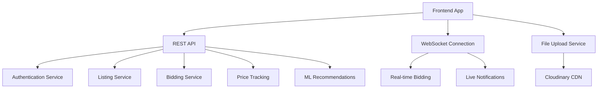

# 🎨 Frontend Integration Guide

## 🚀 **Frontend Development Guide for AgriTech Platform**

This comprehensive guide provides everything frontend developers need to integrate with the AgriTech Smart Bidding Platform API, including authentication, real-time features, and best practices.

---

## 🏗️ **System Architecture Overview**



### **Frontend Tech Stack Recommendations**
- **React.js** with TypeScript (recommended)
- **Next.js** for SSR/SSG
- **Vue.js** or **Angular** (alternative)
- **WebSocket client** for real-time features
- **State management**: Redux/Zustand/Pinia
- **HTTP client**: Axios/Fetch API

---

## 🔐 **Authentication Integration**

### **1. Authentication Flow**

```typescript
// interfaces/auth.ts
interface User {
  id: string;
  email: string;
  first_name: string;
  last_name: string;
  role: 'FARMER' | 'BUYER' | 'AUCTIONEER' | 'ADMIN';
  is_verified: boolean;
  avatar?: {
    url: string;
  };
}

interface AuthResponse {
  user: User;
  access_token: string;
  refresh_token: string;
  token_type: string;
}

interface LoginCredentials {
  email: string;
  password: string;
}
```

### **2. Authentication Service**

```typescript
// services/authService.ts
import axios from 'axios';

class AuthService {
  private baseURL = process.env.NEXT_PUBLIC_API_URL || 'http://localhost:8000/api/v6';
  
  async login(credentials: LoginCredentials): Promise<AuthResponse> {
    const response = await axios.post(`${this.baseURL}/auth/login`, credentials);
    
    if (response.data.data) {
      // Store tokens securely
      localStorage.setItem('access_token', response.data.data.access_token);
      localStorage.setItem('refresh_token', response.data.data.refresh_token);
      localStorage.setItem('user', JSON.stringify(response.data.data.user));
    }
    
    return response.data.data;
  }
  
  async register(userData: RegisterData): Promise<any> {
    const response = await axios.post(`${this.baseURL}/auth/register`, userData);
    return response.data;
  }
  
  async refreshToken(): Promise<string> {
    const refreshToken = localStorage.getItem('refresh_token');
    if (!refreshToken) throw new Error('No refresh token');
    
    const response = await axios.post(`${this.baseURL}/auth/refresh-token`, {
      refresh_token: refreshToken
    });
    
    const newToken = response.data.data.access_token;
    localStorage.setItem('access_token', newToken);
    return newToken;
  }
  
  logout(): void {
    localStorage.removeItem('access_token');
    localStorage.removeItem('refresh_token');
    localStorage.removeItem('user');
  }
  
  getCurrentUser(): User | null {
    const userStr = localStorage.getItem('user');
    return userStr ? JSON.parse(userStr) : null;
  }
  
  getToken(): string | null {
    return localStorage.getItem('access_token');
  }
}

export const authService = new AuthService();
```

### **3. HTTP Interceptor for Authentication**

```typescript
// utils/httpClient.ts
import axios, { AxiosRequestConfig } from 'axios';
import { authService } from '../services/authService';

const httpClient = axios.create({
  baseURL: process.env.NEXT_PUBLIC_API_URL || 'http://localhost:8000/api/v6',
  timeout: 30000,
});

// Request interceptor to add auth token
httpClient.interceptors.request.use(
  (config: AxiosRequestConfig) => {
    const token = authService.getToken();
    if (token) {
      config.headers = {
        ...config.headers,
        Authorization: `Bearer ${token}`,
      };
    }
    return config;
  },
  (error) => Promise.reject(error)
);

// Response interceptor to handle token refresh
httpClient.interceptors.response.use(
  (response) => response,
  async (error) => {
    const originalRequest = error.config;
    
    if (error.response?.status === 401 && !originalRequest._retry) {
      originalRequest._retry = true;
      
      try {
        const newToken = await authService.refreshToken();
        originalRequest.headers.Authorization = `Bearer ${newToken}`;
        return httpClient(originalRequest);
      } catch (refreshError) {
        authService.logout();
        window.location.href = '/login';
        return Promise.reject(refreshError);
      }
    }
    
    return Promise.reject(error);
  }
);

export default httpClient;
```

---

## 🏪 **Listing & Commodity Integration**

### **1. Listing Interfaces**

```typescript
// interfaces/listing.ts
interface Listing {
  id: string;
  name: string;
  slug: string;
  description: string;
  price: number;
  highest_bid: number;
  bids_count: number;
  quantity: number;
  unit: 'KG' | 'TONNES' | 'BAGS' | 'PIECES';
  quality_grade: 'A' | 'B' | 'C' | 'PREMIUM';
  closing_date: string;
  time_remaining: {
    days: number;
    hours: number;
    minutes: number;
  };
  category: {
    id: string;
    name: string;
    slug: string;
  };
  auctioneer: {
    id: string;
    name: string;
    verified: boolean;
    rating: number;
  };
  images: Array<{
    id: string;
    url: string;
    thumbnail: string;
  }>;
  location: string;
  featured: boolean;
  reserve_met: boolean;
  created_at: string;
}

interface ListingFilters {
  category_id?: string;
  search?: string;
  min_price?: number;
  max_price?: number;
  status?: 'active' | 'closed' | 'all';
  location?: string;
  quality_grade?: string;
  page?: number;
  size?: number;
  sort?: 'price_asc' | 'price_desc' | 'date_asc' | 'date_desc';
}
```

### **2. Listing Service**

```typescript
// services/listingService.ts
class ListingService {
  async getListings(filters: ListingFilters = {}): Promise<{
    data: Listing[];
    pagination: PaginationInfo;
  }> {
    const params = new URLSearchParams();
    Object.entries(filters).forEach(([key, value]) => {
      if (value !== undefined) {
        params.append(key, value.toString());
      }
    });
    
    const response = await httpClient.get(`/listings?${params.toString()}`);
    return {
      data: response.data.data,
      pagination: response.data.pagination
    };
  }
  
  async getListingDetails(id: string): Promise<Listing> {
    const response = await httpClient.get(`/listings/${id}`);
    return response.data.data;
  }
  
  async createListing(listingData: CreateListingData): Promise<Listing> {
    const response = await httpClient.post('/listings', listingData);
    return response.data.data;
  }
  
  async searchListings(query: string): Promise<Listing[]> {
    const response = await httpClient.get(`/listings?search=${encodeURIComponent(query)}`);
    return response.data.data;
  }
}

export const listingService = new ListingService();
```

### **3. React Component Example**

```typescript
// components/ListingCard.tsx
import React from 'react';
import { Listing } from '../interfaces/listing';

interface ListingCardProps {
  listing: Listing;
  onBidClick?: (listing: Listing) => void;
  onWatchlistClick?: (listing: Listing) => void;
}

export const ListingCard: React.FC<ListingCardProps> = ({
  listing,
  onBidClick,
  onWatchlistClick
}) => {
  const formatTimeRemaining = (time: Listing['time_remaining']) => {
    if (time.days > 0) return `${time.days}d ${time.hours}h ${time.minutes}m`;
    if (time.hours > 0) return `${time.hours}h ${time.minutes}m`;
    return `${time.minutes}m`;
  };
  
  const formatPrice = (price: number) => {
    return new Intl.NumberFormat('en-IN', {
      style: 'currency',
      currency: 'INR'
    }).format(price);
  };
  
  return (
    <div className="listing-card bg-white rounded-lg shadow-md overflow-hidden">
      {/* Image */}
      <div className="relative">
        
        {listing.featured && (
          <div className="absolute top-2 left-2 bg-yellow-500 text-white px-2 py-1 rounded text-sm">
            Featured
          </div>
        )}
        <button
          onClick={() => onWatchlistClick?.(listing)}
          className="absolute top-2 right-2 bg-white rounded-full p-2 shadow-md"
        >
          ❤️
        </button>
      </div>
      
      {/* Content */}
      <div className="p-4">
        <h3 className="text-lg font-semibold text-gray-900 mb-2">
          {listing.name}
        </h3>
        
        <div className="flex items-center justify-between mb-2">
          <span className="text-sm text-gray-600">{listing.category.name}</span>
          <span className="text-sm text-gray-600">{listing.location}</span>
        </div>
        
        <div className="flex items-center justify-between mb-2">
          <span className="text-sm text-gray-600">
            {listing.quantity} {listing.unit}
          </span>
          <span className="bg-green-100 text-green-800 text-xs px-2 py-1 rounded">
            Grade {listing.quality_grade}
          </span>
        </div>
        
        {/* Price Information */}
        <div className="mb-3">
          <div className="flex items-center justify-between">
            <span className="text-sm text-gray-600">Current Bid:</span>
            <span className="text-lg font-bold text-green-600">
              {formatPrice(listing.highest_bid || listing.price)}
            </span>
          </div>
          <div className="flex items-center justify-between text-sm text-gray-600">
            <span>{listing.bids_count} bids</span>
            <span>Ends in {formatTimeRemaining(listing.time_remaining)}</span>
          </div>
        </div>
        
        {/* Auctioneer Info */}
        <div className="flex items-center justify-between mb-3">
          <div className="flex items-center">
            <span className="text-sm text-gray-600">By:</span>
            <span className="text-sm font-medium ml-1">{listing.auctioneer.name}</span>
            {listing.auctioneer.verified && (
              <span className="ml-1 text-blue-500">✓</span>
            )}
          </div>
          <div className="flex items-center">
            <span className="text-yellow-500">★</span>
            <span className="text-sm text-gray-600 ml-1">
              {listing.auctioneer.rating.toFixed(1)}
            </span>
          </div>
        </div>
        
        {/* Action Button */}
        <button
          onClick={() => onBidClick?.(listing)}
          className="w-full bg-blue-600 text-white py-2 px-4 rounded hover:bg-blue-700 transition-colors"
        >
          Place Bid
        </button>
      </div>
    </div>
  );
};
```

---

## 🎯 **Bidding Integration**

### **1. Bidding Service**

```typescript
// services/biddingService.ts
interface BidData {
  amount: number;
  auto_bid?: boolean;
  max_auto_bid?: number;
}

interface BidResponse {
  bid_id: string;
  amount: number;
  is_winning: boolean;
  previous_highest: number;
  next_minimum: number;
  time_remaining: {
    days: number;
    hours: number;
    minutes: number;
  };
}

class BiddingService {
  async placeBid(listingId: string, bidData: BidData): Promise<BidResponse> {
    const response = await httpClient.post(`/listings/${listingId}/bids`, bidData);
    return response.data.data;
  }
  
  async getBidHistory(listingId: string): Promise<{
    data: Bid[];
    statistics: BidStatistics;
  }> {
    const response = await httpClient.get(`/listings/${listingId}/bids`);
    return response.data;
  }
  
  async setupAutoBid(listingId: string, autoBidData: AutoBidData): Promise<any> {
    const response = await httpClient.post(`/listings/${listingId}/auto-bid`, autoBidData);
    return response.data.data;
  }
}

export const biddingService = new BiddingService();
```

### **2. Bid Form Component**

```typescript
// components/BidForm.tsx
import React, { useState } from 'react';
import { biddingService } from '../services/biddingService';

interface BidFormProps {
  listing: Listing;
  onBidSuccess: (bidResponse: BidResponse) => void;
  onClose: () => void;
}

export const BidForm: React.FC<BidFormProps> = ({
  listing,
  onBidSuccess,
  onClose
}) => {
  const [bidAmount, setBidAmount] = useState<string>('');
  const [isAutoBid, setIsAutoBid] = useState(false);
  const [maxAutoBid, setMaxAutoBid] = useState<string>('');
  const [isLoading, setIsLoading] = useState(false);
  const [error, setError] = useState<string>('');
  
  const minBid = (listing.highest_bid || listing.price) + 1;
  
  const handleSubmit = async (e: React.FormEvent) => {
    e.preventDefault();
    setIsLoading(true);
    setError('');
    
    try {
      const bidData: BidData = {
        amount: parseFloat(bidAmount),
        auto_bid: isAutoBid,
        max_auto_bid: isAutoBid ? parseFloat(maxAutoBid) : undefined
      };
      
      const response = await biddingService.placeBid(listing.id, bidData);
      onBidSuccess(response);
      onClose();
    } catch (err: any) {
      setError(err.response?.data?.message || 'Failed to place bid');
    } finally {
      setIsLoading(false);
    }
  };
  
  return (
    <div className="fixed inset-0 bg-black bg-opacity-50 flex items-center justify-center z-50">
      <div className="bg-white rounded-lg p-6 w-full max-w-md">
        <h2 className="text-xl font-bold mb-4">Place Bid - {listing.name}</h2>
        
        <div className="mb-4 p-3 bg-gray-100 rounded">
          <div className="flex justify-between">
            <span>Current Bid:</span>
            <span className="font-bold">₹{listing.highest_bid || listing.price}</span>
          </div>
          <div className="flex justify-between">
            <span>Minimum Bid:</span>
            <span className="font-bold text-green-600">₹{minBid}</span>
          </div>
        </div>
        
        <form onSubmit={handleSubmit}>
          <div className="mb-4">
            <label className="block text-sm font-medium text-gray-700 mb-2">
              Your Bid Amount (₹)
            </label>
            <input
              type="number"
              value={bidAmount}
              onChange={(e) => setBidAmount(e.target.value)}
              min={minBid}
              step="0.01"
              required
              className="w-full px-3 py-2 border border-gray-300 rounded-md focus:outline-none focus:ring-2 focus:ring-blue-500"
              placeholder={`Minimum ₹${minBid}`}
            />
          </div>
          
          <div className="mb-4">
            <label className="flex items-center">
              <input
                type="checkbox"
                checked={isAutoBid}
                onChange={(e) => setIsAutoBid(e.target.checked)}
                className="mr-2"
              />
              <span className="text-sm">Enable Auto-bidding</span>
            </label>
          </div>
          
          {isAutoBid && (
            <div className="mb-4">
              <label className="block text-sm font-medium text-gray-700 mb-2">
                Maximum Auto-bid Amount (₹)
              </label>
              <input
                type="number"
                value={maxAutoBid}
                onChange={(e) => setMaxAutoBid(e.target.value)}
                min={parseFloat(bidAmount) || minBid}
                step="0.01"
                required
                className="w-full px-3 py-2 border border-gray-300 rounded-md focus:outline-none focus:ring-2 focus:ring-blue-500"
              />
            </div>
          )}
          
          {error && (
            <div className="mb-4 p-3 bg-red-100 border border-red-400 text-red-700 rounded">
              {error}
            </div>
          )}
          
          <div className="flex space-x-3">
            <button
              type="button"
              onClick={onClose}
              className="flex-1 px-4 py-2 border border-gray-300 rounded-md text-gray-700 hover:bg-gray-50"
            >
              Cancel
            </button>
            <button
              type="submit"
              disabled={isLoading}
              className="flex-1 px-4 py-2 bg-blue-600 text-white rounded-md hover:bg-blue-700 disabled:opacity-50"
            >
              {isLoading ? 'Placing Bid...' : 'Place Bid'}
            </button>
          </div>
        </form>
      </div>
    </div>
  );
};
```

---

## ⚡ **Real-time WebSocket Integration**

### **1. WebSocket Service**

```typescript
// services/websocketService.ts
interface WebSocketMessage {
  type: 'new_bid' | 'auction_extended' | 'auction_ended' | 'price_update';
  data: any;
}

class WebSocketService {
  private ws: WebSocket | null = null;
  private reconnectAttempts = 0;
  private maxReconnectAttempts = 5;
  private listeners: Map<string, Function[]> = new Map();
  
  connect(listingId: string, token?: string): void {
    const wsUrl = `ws://localhost:8000/api/v6/realtime/ws/${listingId}${token ? `?token=${token}` : ''}`;
    
    this.ws = new WebSocket(wsUrl);
    
    this.ws.onopen = () => {
      console.log('WebSocket connected');
      this.reconnectAttempts = 0;
    };
    
    this.ws.onmessage = (event) => {
      try {
        const message: WebSocketMessage = JSON.parse(event.data);
        this.notifyListeners(message.type, message.data);
      } catch (error) {
        console.error('Failed to parse WebSocket message:', error);
      }
    };
    
    this.ws.onclose = () => {
      console.log('WebSocket disconnected');
      this.attemptReconnect(listingId, token);
    };
    
    this.ws.onerror = (error) => {
      console.error('WebSocket error:', error);
    };
  }
  
  private attemptReconnect(listingId: string, token?: string): void {
    if (this.reconnectAttempts < this.maxReconnectAttempts) {
      this.reconnectAttempts++;
      setTimeout(() => {
        console.log(`Attempting to reconnect (${this.reconnectAttempts}/${this.maxReconnectAttempts})`);
        this.connect(listingId, token);
      }, 2000 * this.reconnectAttempts);
    }
  }
  
  subscribe(eventType: string, callback: Function): void {
    if (!this.listeners.has(eventType)) {
      this.listeners.set(eventType, []);
    }
    this.listeners.get(eventType)!.push(callback);
  }
  
  unsubscribe(eventType: string, callback: Function): void {
    const listeners = this.listeners.get(eventType);
    if (listeners) {
      const index = listeners.indexOf(callback);
      if (index > -1) {
        listeners.splice(index, 1);
      }
    }
  }
  
  private notifyListeners(eventType: string, data: any): void {
    const listeners = this.listeners.get(eventType);
    if (listeners) {
      listeners.forEach(callback => callback(data));
    }
  }
  
  disconnect(): void {
    if (this.ws) {
      this.ws.close();
      this.ws = null;
    }
    this.listeners.clear();
  }
}

export const websocketService = new WebSocketService();
```

### **2. Real-time Bid Updates Component**

```typescript
// components/RealTimeBidding.tsx
import React, { useEffect, useState } from 'react';
import { websocketService } from '../services/websocketService';

interface RealTimeBiddingProps {
  listing: Listing;
  onListingUpdate: (updatedListing: Partial<Listing>) => void;
}

export const RealTimeBidding: React.FC<RealTimeBiddingProps> = ({
  listing,
  onListingUpdate
}) => {
  const [isConnected, setIsConnected] = useState(false);
  const [lastBidUpdate, setLastBidUpdate] = useState<any>(null);
  
  useEffect(() => {
    const token = authService.getToken();
    
    // Connect to WebSocket
    websocketService.connect(listing.id, token || undefined);
    
    // Subscribe to events
    const handleNewBid = (data: any) => {
      setLastBidUpdate(data);
      onListingUpdate({
        highest_bid: data.bid_amount,
        bids_count: listing.bids_count + 1
      });
      
      // Show notification
      showNotification('New bid placed!', `New bid: ₹${data.bid_amount}`);
    };
    
    const handleAuctionExtended = (data: any) => {
      onListingUpdate({
        closing_date: data.new_closing_time
      });
      
      showNotification('Auction Extended!', `Extended by ${data.extension_minutes} minutes`);
    };
    
    const handleAuctionEnded = (data: any) => {
      showNotification('Auction Ended!', `Winning bid: ₹${data.winning_bid}`);
    };
    
    websocketService.subscribe('new_bid', handleNewBid);
    websocketService.subscribe('auction_extended', handleAuctionExtended);
    websocketService.subscribe('auction_ended', handleAuctionEnded);
    
    return () => {
      websocketService.unsubscribe('new_bid', handleNewBid);
      websocketService.unsubscribe('auction_extended', handleAuctionExtended);
      websocketService.unsubscribe('auction_ended', handleAuctionEnded);
      websocketService.disconnect();
    };
  }, [listing.id]);
  
  const showNotification = (title: string, message: string) => {
    if ('Notification' in window && Notification.permission === 'granted') {
      new Notification(title, { body: message });
    }
  };
  
  return (
    <div className="bg-blue-50 border border-blue-200 rounded-lg p-4 mb-4">
      <div className="flex items-center justify-between">
        <div className="flex items-center">
          <div className={`w-3 h-3 rounded-full mr-2 ${isConnected ? 'bg-green-500' : 'bg-red-500'}`}></div>
          <span className="text-sm font-medium">Live Bidding</span>
        </div>
        <span className="text-xs text-gray-600">
          {isConnected ? 'Connected' : 'Connecting...'}
        </span>
      </div>
      
      {lastBidUpdate && (
        <div className="mt-2 p-2 bg-white rounded text-sm">
          <strong>Latest:</strong> ₹{lastBidUpdate.bid_amount} by {lastBidUpdate.bidder}
        </div>
      )}
    </div>
  );
};
```

---

## 📊 **Price Tracking Integration**

### **1. Price Chart Component**

```typescript
// components/PriceChart.tsx
import React, { useEffect, useState } from 'react';
import { Line } from 'react-chartjs-2';

interface PriceChartProps {
  commoditySlug: string;
  days?: number;
}

export const PriceChart: React.FC<PriceChartProps> = ({ 
  commoditySlug, 
  days = 30 
}) => {
  const [priceData, setPriceData] = useState<any>(null);
  const [loading, setLoading] = useState(true);
  
  useEffect(() => {
    fetchPriceHistory();
  }, [commoditySlug, days]);
  
  const fetchPriceHistory = async () => {
    try {
      const response = await httpClient.get(`/price-tracking/history`, {
        params: { commodity_slug: commoditySlug, days }
      });
      
      const data = response.data.data;
      
      const chartData = {
        labels: data.history.map((item: any) => 
          new Date(item.date).toLocaleDateString()
        ),
        datasets: [
          {
            label: 'Price (₹)',
            data: data.history.map((item: any) => item.price),
            borderColor: 'rgb(59, 130, 246)',
            backgroundColor: 'rgba(59, 130, 246, 0.1)',
            tension: 0.4,
          },
        ],
      };
      
      setPriceData({
        chartData,
        statistics: data.statistics,
        currentPrice: data.current_price,
        priceChange: data.price_change_24h,
        priceChangePercent: data.price_change_percent
      });
    } catch (error) {
      console.error('Failed to fetch price history:', error);
    } finally {
      setLoading(false);
    }
  };
  
  if (loading) {
    return <div className="animate-pulse bg-gray-200 h-64 rounded"></div>;
  }
  
  if (!priceData) {
    return <div className="text-center py-8">Failed to load price data</div>;
  }
  
  return (
    <div className="bg-white rounded-lg shadow-md p-6">
      <div className="flex items-center justify-between mb-6">
        <h3 className="text-lg font-semibold">Price History ({days} days)</h3>
        <div className="text-right">
          <div className="text-2xl font-bold">₹{priceData.currentPrice}</div>
          <div className={`text-sm ${priceData.priceChange >= 0 ? 'text-green-600' : 'text-red-600'}`}>
            {priceData.priceChange >= 0 ? '+' : ''}₹{priceData.priceChange} 
            ({priceData.priceChangePercent >= 0 ? '+' : ''}{priceData.priceChangePercent}%)
          </div>
        </div>
      </div>
      
      <div className="h-64">
        <Line
          data={priceData.chartData}
          options={{
            responsive: true,
            maintainAspectRatio: false,
            scales: {
              y: {
                beginAtZero: false,
                title: {
                  display: true,
                  text: 'Price (₹)'
                }
              },
              x: {
                title: {
                  display: true,
                  text: 'Date'
                }
              }
            },
            plugins: {
              tooltip: {
                mode: 'index',
                intersect: false,
              },
            },
          }}
        />
      </div>
      
      <div className="grid grid-cols-3 gap-4 mt-4 pt-4 border-t">
        <div className="text-center">
          <div className="text-sm text-gray-600">30-day Avg</div>
          <div className="font-semibold">₹{priceData.statistics.avg_price_30d}</div>
        </div>
        <div className="text-center">
          <div className="text-sm text-gray-600">30-day High</div>
          <div className="font-semibold text-green-600">₹{priceData.statistics.max_price_30d}</div>
        </div>
        <div className="text-center">
          <div className="text-sm text-gray-600">30-day Low</div>
          <div className="font-semibold text-red-600">₹{priceData.statistics.min_price_30d}</div>
        </div>
      </div>
    </div>
  );
};
```

---

## 🤖 **ML Recommendations Integration**

### **1. Recommendations Service**

```typescript
// services/recommendationService.ts
interface TradingRecommendation {
  suggestion: 'BUY' | 'SELL' | 'HOLD';
  current_price: number;
  predicted_price: number;
  confidence: number;
  price_change_pct: number;
  reason: string;
  factors: string[];
}

class RecommendationService {
  async getTradingRecommendation(commoditySlug: string): Promise<TradingRecommendation> {
    const response = await httpClient.get(`/ml/recommendations/${commoditySlug}`);
    return response.data.data;
  }
  
  async getPricePredictions(commoditySlug: string): Promise<any> {
    const response = await httpClient.get(`/ml/predictions/${commoditySlug}`);
    return response.data.data;
  }
}

export const recommendationService = new RecommendationService();
```

### **2. Recommendation Card Component**

```typescript
// components/RecommendationCard.tsx
import React, { useEffect, useState } from 'react';
import { recommendationService } from '../services/recommendationService';

interface RecommendationCardProps {
  commoditySlug: string;
}

export const RecommendationCard: React.FC<RecommendationCardProps> = ({ 
  commoditySlug 
}) => {
  const [recommendation, setRecommendation] = useState<TradingRecommendation | null>(null);
  const [loading, setLoading] = useState(true);
  
  useEffect(() => {
    fetchRecommendation();
  }, [commoditySlug]);
  
  const fetchRecommendation = async () => {
    try {
      const rec = await recommendationService.getTradingRecommendation(commoditySlug);
      setRecommendation(rec);
    } catch (error) {
      console.error('Failed to fetch recommendation:', error);
    } finally {
      setLoading(false);
    }
  };
  
  if (loading) {
    return <div className="animate-pulse bg-gray-200 h-32 rounded"></div>;
  }
  
  if (!recommendation) {
    return null;
  }
  
  const getRecommendationColor = (suggestion: string) => {
    switch (suggestion) {
      case 'BUY': return 'bg-green-100 text-green-800 border-green-200';
      case 'SELL': return 'bg-red-100 text-red-800 border-red-200';
      case 'HOLD': return 'bg-yellow-100 text-yellow-800 border-yellow-200';
      default: return 'bg-gray-100 text-gray-800 border-gray-200';
    }
  };
  
  return (
    <div className="bg-white rounded-lg shadow-md p-6">
      <div className="flex items-center justify-between mb-4">
        <h3 className="text-lg font-semibold">AI Recommendation</h3>
        <div className={`px-3 py-1 rounded border ${getRecommendationColor(recommendation.suggestion)}`}>
          {recommendation.suggestion}
        </div>
      </div>
      
      <div className="grid grid-cols-2 gap-4 mb-4">
        <div>
          <div className="text-sm text-gray-600">Current Price</div>
          <div className="text-lg font-semibold">₹{recommendation.current_price}</div>
        </div>
        <div>
          <div className="text-sm text-gray-600">Predicted Price</div>
          <div className="text-lg font-semibold">₹{recommendation.predicted_price}</div>
        </div>
      </div>
      
      <div className="mb-4">
        <div className="flex items-center justify-between mb-2">
          <span className="text-sm text-gray-600">Confidence</span>
          <span className="text-sm font-medium">{(recommendation.confidence * 100).toFixed(1)}%</span>
        </div>
        <div className="w-full bg-gray-200 rounded-full h-2">
          <div 
            className="bg-blue-600 h-2 rounded-full" 
            style={{ width: `${recommendation.confidence * 100}%` }}
          ></div>
        </div>
      </div>
      
      <div className="mb-4">
        <div className="text-sm text-gray-600 mb-1">Reasoning</div>
        <div className="text-sm">{recommendation.reason}</div>
      </div>
      
      {recommendation.factors.length > 0 && (
        <div>
          <div className="text-sm text-gray-600 mb-2">Key Factors</div>
          <ul className="text-sm space-y-1">
            {recommendation.factors.map((factor, index) => (
              <li key={index} className="flex items-start">
                <span className="text-blue-500 mr-2">•</span>
                {factor}
              </li>
            ))}
          </ul>
        </div>
      )}
    </div>
  );
};
```

---

## 📱 **Mobile & PWA Integration**

### **1. Push Notification Setup**

```typescript
// services/notificationService.ts
class NotificationService {
  async requestPermission(): Promise<boolean> {
    if (!('Notification' in window)) {
      console.log('This browser does not support notifications');
      return false;
    }
    
    const permission = await Notification.requestPermission();
    return permission === 'granted';
  }
  
  async registerDevice(fcmToken: string): Promise<void> {
    const deviceInfo = {
      device_id: this.getDeviceId(),
      fcm_token: fcmToken,
      device_type: this.getDeviceType(),
      device_model: navigator.userAgent,
      app_version: process.env.REACT_APP_VERSION || '1.0.0'
    };
    
    await httpClient.post('/mobile/register-device', deviceInfo);
  }
  
  private getDeviceId(): string {
    // Generate or retrieve unique device ID
    let deviceId = localStorage.getItem('device_id');
    if (!deviceId) {
      deviceId = 'web_' + Math.random().toString(36).substr(2, 9);
      localStorage.setItem('device_id', deviceId);
    }
    return deviceId;
  }
  
  private getDeviceType(): string {
    const userAgent = navigator.userAgent;
    if (/Android/i.test(userAgent)) return 'ANDROID';
    if (/iPhone|iPad|iPod/i.test(userAgent)) return 'IOS';
    return 'WEB';
  }
}

export const notificationService = new NotificationService();
```

### **2. Service Worker for PWA**

```javascript
// public/sw.js
const CACHE_NAME = 'agritech-v1';
const urlsToCache = [
  '/',
  '/static/js/bundle.js',
  '/static/css/main.css',
  '/manifest.json'
];

self.addEventListener('install', (event) => {
  event.waitUntil(
    caches.open(CACHE_NAME)
      .then((cache) => cache.addAll(urlsToCache))
  );
});

self.addEventListener('fetch', (event) => {
  event.respondWith(
    caches.match(event.request)
      .then((response) => {
        if (response) {
          return response;
        }
        return fetch(event.request);
      })
  );
});

// Handle push notifications
self.addEventListener('push', (event) => {
  const options = {
    body: event.data.text(),
    icon: '/icon-192x192.png',
    badge: '/badge-72x72.png',
    vibrate: [100, 50, 100],
    data: {
      dateOfArrival: Date.now(),
      primaryKey: 1
    },
    actions: [
      {
        action: 'explore',
        title: 'View Details',
        icon: '/view-icon.png'
      },
      {
        action: 'close',
        title: 'Close',
        icon: '/close-icon.png'
      }
    ]
  };
  
  event.waitUntil(
    self.registration.showNotification('AgriTech Platform', options)
  );
});
```

---

## 🛠️ **Development Best Practices**

### **1. Environment Configuration**

```typescript
// config/environment.ts
interface EnvironmentConfig {
  API_URL: string;
  WS_URL: string;
  ENVIRONMENT: 'development' | 'staging' | 'production';
  DEBUG: boolean;
}

const config: EnvironmentConfig = {
  API_URL: process.env.REACT_APP_API_URL || 'http://localhost:8000/api/v6',
  WS_URL: process.env.REACT_APP_WS_URL || 'ws://localhost:8000/api/v6/realtime',
  ENVIRONMENT: (process.env.NODE_ENV as any) || 'development',
  DEBUG: process.env.NODE_ENV === 'development'
};

export default config;
```

### **2. Error Handling**

```typescript
// utils/errorHandler.ts
interface ApiError {
  message: string;
  details?: Record<string, string[]>;
  status?: number;
}

export const handleApiError = (error: any): ApiError => {
  if (error.response) {
    return {
      message: error.response.data.message || 'An error occurred',
      details: error.response.data.details,
      status: error.response.status
    };
  } else if (error.request) {
    return {
      message: 'Network error - please check your connection',
      status: 0
    };
  } else {
    return {
      message: error.message || 'An unexpected error occurred'
    };
  }
};

// Error Boundary Component
export class ErrorBoundary extends React.Component<
  { children: React.ReactNode },
  { hasError: boolean; error?: Error }
> {
  constructor(props: any) {
    super(props);
    this.state = { hasError: false };
  }
  
  static getDerivedStateFromError(error: Error) {
    return { hasError: true, error };
  }
  
  componentDidCatch(error: Error, errorInfo: React.ErrorInfo) {
    console.error('Error caught by boundary:', error, errorInfo);
  }
  
  render() {
    if (this.state.hasError) {
      return (
        <div className="min-h-screen flex items-center justify-center bg-gray-50">
          <div className="text-center">
            <h1 className="text-2xl font-bold text-gray-900 mb-4">
              Something went wrong
            </h1>
            <p className="text-gray-600 mb-4">
              We're sorry, but something unexpected happened.
            </p>
            <button
              onClick={() => window.location.reload()}
              className="bg-blue-600 text-white px-4 py-2 rounded hover:bg-blue-700"
            >
              Reload Page
            </button>
          </div>
        </div>
      );
    }
    
    return this.props.children;
  }
}
```

### **3. Performance Optimization**

```typescript
// hooks/useDebounce.ts
import { useState, useEffect } from 'react';

export function useDebounce<T>(value: T, delay: number): T {
  const [debouncedValue, setDebouncedValue] = useState<T>(value);
  
  useEffect(() => {
    const handler = setTimeout(() => {
      setDebouncedValue(value);
    }, delay);
    
    return () => {
      clearTimeout(handler);
    };
  }, [value, delay]);
  
  return debouncedValue;
}

// hooks/useInfiniteScroll.ts
import { useState, useEffect, useCallback } from 'react';

export function useInfiniteScroll(
  fetchMore: () => Promise<void>,
  hasMore: boolean
) {
  const [isFetching, setIsFetching] = useState(false);
  
  const handleScroll = useCallback(() => {
    if (window.innerHeight + document.documentElement.scrollTop !== 
        document.documentElement.offsetHeight || isFetching) {
      return;
    }
    setIsFetching(true);
  }, [isFetching]);
  
  useEffect(() => {
    window.addEventListener('scroll', handleScroll);
    return () => window.removeEventListener('scroll', handleScroll);
  }, [handleScroll]);
  
  useEffect(() => {
    if (!isFetching) return;
    
    if (hasMore) {
      fetchMore().finally(() => setIsFetching(false));
    } else {
      setIsFetching(false);
    }
  }, [isFetching, fetchMore, hasMore]);
  
  return [isFetching, setIsFetching] as const;
}
```

This comprehensive frontend integration guide provides everything needed to build a complete frontend application that integrates seamlessly with the AgriTech Platform API, including real-time features, authentication, and advanced functionality.
